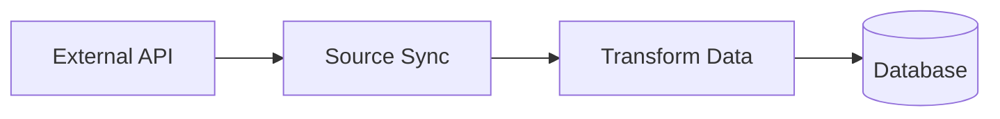

## Intent

[Brief description of what this source does and why it exists]

## Data Source

- **API/Service**: [Name of the external API or service]
- **Authentication**: [Type of auth required - API key, OAuth, etc.]
- **Rate Limits**: [Any rate limiting considerations]

## Tables

List all database tables this source creates or updates:

- `table_name`: Brief description
  - `column1` (type): Description
  - `column2` (type): Description
  - Primary key: `id`

## Behavior

- **Sync Strategy**: [Full sync, incremental, upsert by key]
- **Schedule**: [Cron expression if scheduled, e.g., "0 */6 * * *" = every 6 hours]
- **Error Handling**: [How errors are handled - retry, skip, fail]

## Diagram



## Example Output

```sql
-- Example of what gets inserted
INSERT INTO table_name (id, field1, field2)
VALUES ('abc123', 'value1', 'value2')
ON CONFLICT (id) DO UPDATE SET
  field1 = EXCLUDED.field1,
  field2 = EXCLUDED.field2;
```

## Testing

Test file: `sources/{name}/{name}.test.ts`

Key assertions:
- [ ] Correct tables are created
- [ ] Data is properly transformed
- [ ] Upsert logic works correctly
- [ ] Handles API errors gracefully
